# WE816-MARK2
The WE816 is a 16-bit 65816 based system with 512K of System RAM, 96K of System ROM, 32K of video RAM, a Raspberry PI Pico based graphics processor and an AY-3-8910 Sound chip.  The system runs a custom version of BASIC and supports commodore compatible IEC disk drives.

EhBASIC by Lee Davison was ported to the 65816 CPU on the WE816 computer.   It is designed to allow a full 64K bank for BASIC code and variables with the BASIC interpreter running in a totally different bank. Full documentation on the basic intrepreter can be found in the support folder

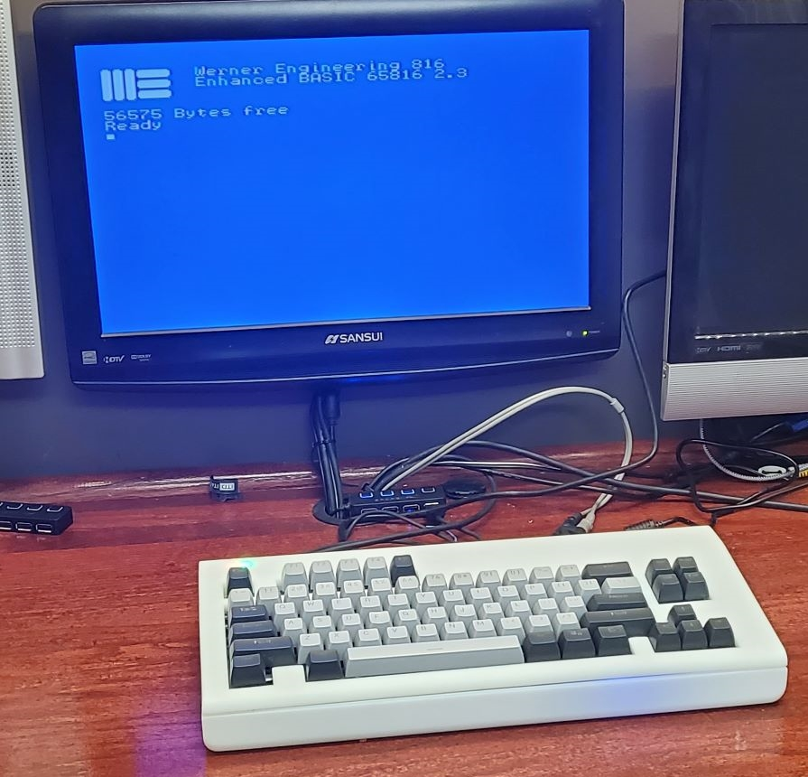
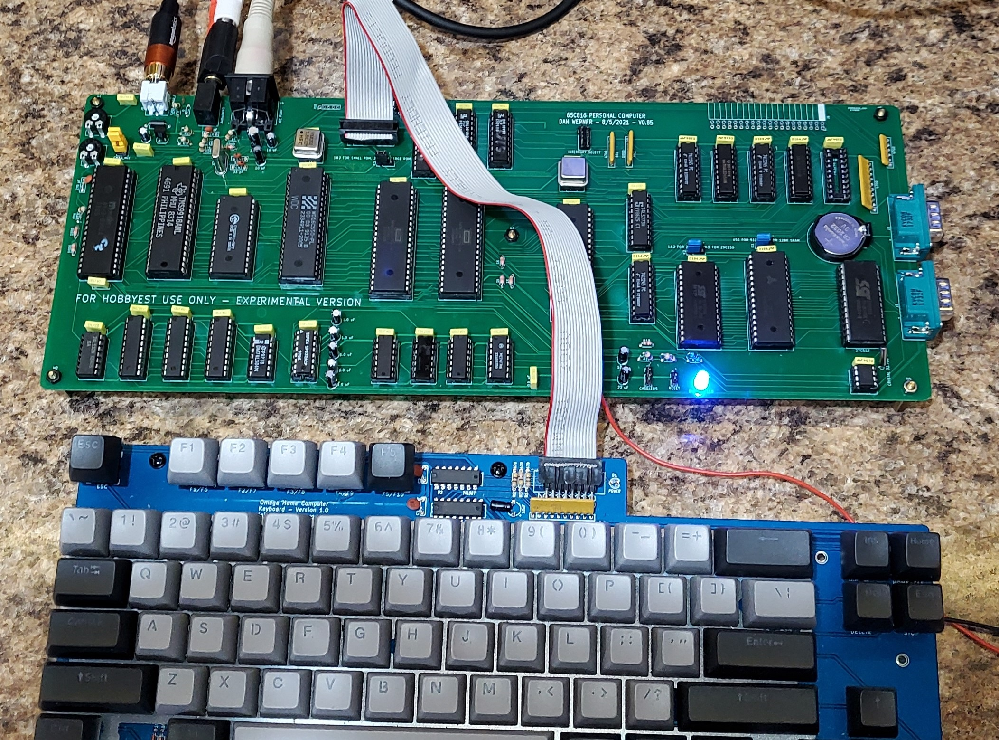

** WORK IN PROGRESS, NOT READY FOR BUILD

---

## Bugs:
* V0.08 board
        U13 should be a 22V10 rather than a 20V8  (no patches required)
        U31 should be 74ALS245 rather than 74AC245 (no patches required)

## To Do:
* Fix Reset Circuit

* BIOS RTC Code
* Basic Access to RTC
* Add Support to new video
* Document BIOS Calls

* Video speed is not fast enough to deal with a clock speed > (around) 2mhz (1.8 work perfectly)  Need to add wait state hardware for video
* Work on Video Firmware for Pi Pico
** Sprites
** Hires Graphics (with pallette)
** Lores Graphics (more colors also with pallette)
** Reassign control bits to make them more sane

---

## What is included in this repo?
As of this time, the repo includes

1. The WE816-Mark2 Mainboard PCB Kicad design and Gerber files
2. The source code and binaries for the WE816 BASIC interpreter
3. The source code and binaries for the WE816 BIOS firmware
4. The source code and binaries for several hardware test programs
5. The logic equasions for the 4 GALs
6. **OpenSCAD and STL files for a 3d printed case
7. The Firmware for the Raspberry Pi Pico Video  

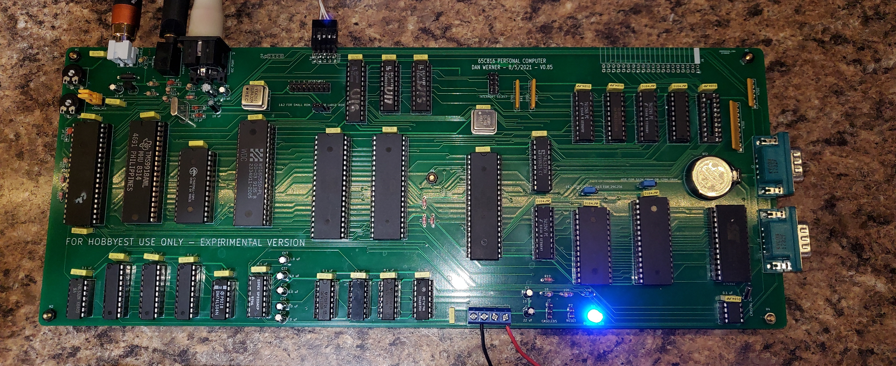
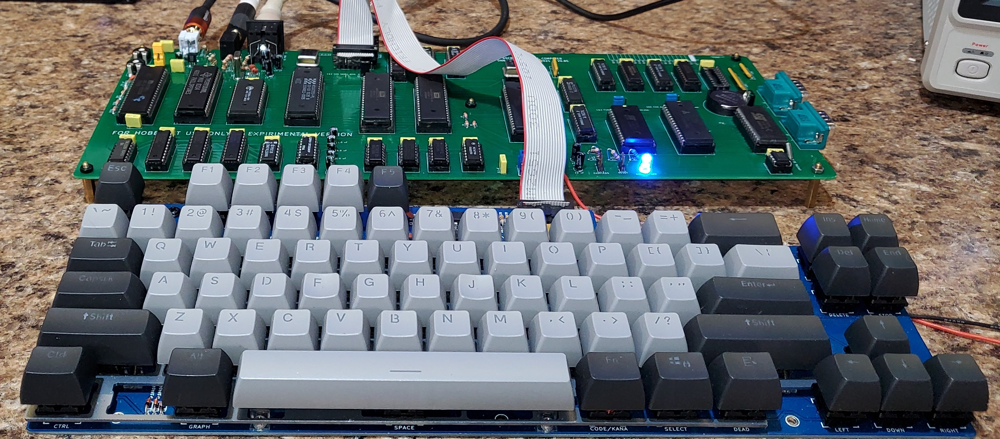

---

## Known Bugs

### System Jumpers

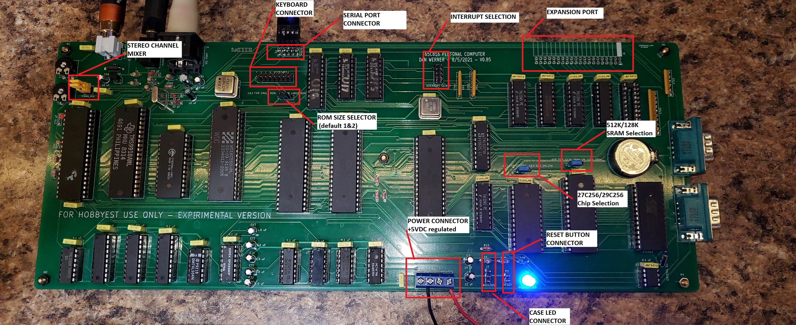

Jumper P9 -- stereo channel mixer

 *  no jumpers, channel a left, channel c right, channel b left and right
 *  1-2 and 2-3 , channel a,b,c mixed to left and right

Jumper K1 - SRAM chip selection

 * 1&2 - 512K chip used (AS6C4008)
 * 2&3 - 128K chip used (AS6C1008)

Jumper K2 - ROM chip selection

 * 1&2 - 27c256 chip used
 * 2&3 - 29c256 chip used

Jumper K3 - ROM size

 * 1&2 - 16K rom page 0 memory map @ $C000
 * 2&3 - 32K rom page 0 memory map @ $8000

Power P1

 * 1- NC
 * 2-GND
 * 3-GND
 * 4-+5VDC 2A Regulated

Reset P2

 * NO Switch (Short to put system in reset)

Jumper J1, Interrupt Select

* 1&8 UART Interrupt enabled
* 2&7 VIA 1 Interrupt enabled
* 3&6 VIA 2 Interrupt enabled
* 4&5 TMS9918 Interrupt enabled

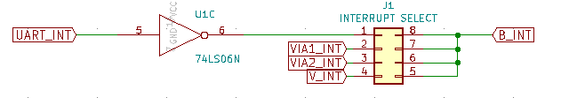

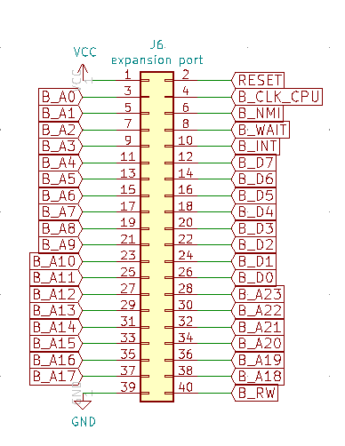

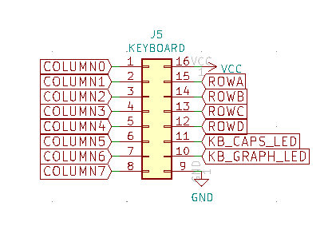

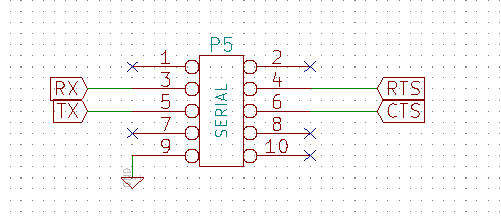

---

## Video Programming
IO PORTS

Address|Description|Value|Value
--------|--------|----------|--------
$fe30 | Scan Line Emulation | on | off
$fe31 | Display Page | page 0 | page 1
$fe32 | character generator write offset | write offset |
$fe33 | character generator write | Value |
$fe34 | device command  | Command |
$fe35 | Text Mode  | on | off
$fe36 | Lores Mode  | on | off
$fe37 | Double Lores Mode (must be in lores first)  | on | off
$fe38 | Hires Mode | on | off
$fe39 | Double Hires Mode (must be in hires first)  | on | off
$fe3A | 80 Col Mode (must be in text mode)  | on | off
$fe3b | Mixed Mode   (must be in lores/hires first) | on | off
$fe3c | Quad Hires  (must be in hires first) | on | off
$fe3d | Mono Hires  (must be in hires first)| on | off

## Bill Of Materials

### Mainboard

Qty|Reference(s)|Value
--------|--------|----------

### Keyboard
The Keyboard used in the WE816 is identical to the keyboard used in Sergey Kiselev's MSX compatible OMEGA computer.  See the Schematics, PCB layout and build instructions
[here](https://github.com/skiselev/omega/blob/master/Keyboard.md)

### Case
The case in the following images is a 3D print manufactured by the 3D print service offered by JLCPCB.com.  The case was originally designed to be 3D printed by a FDM printer such as the Anycubic Chiron.   It was originally intended that threaded inserts be melted into the stand off posts so the diameter of the holes were sized accordingly.  If a printing service (such as JLCPCB) is used that uses resin printing, it is necessary to slightly drill out the holes in the stand offs so that threaded inserts can be glued in.   It should also be noted that the design tolerances are quite tight and variations in printing can mean that some slight adjusting may be needed in order to get a good fit.

A 12V to 5V converter can be seen in the image that was added into the case in order to convert the 12V power input to the 5B required by the main board.

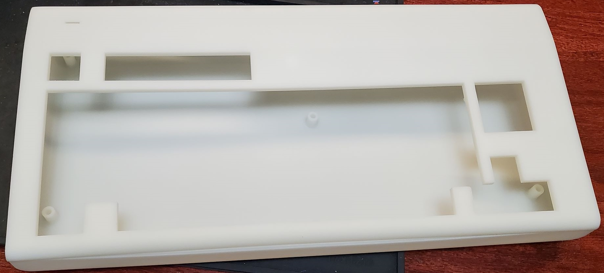
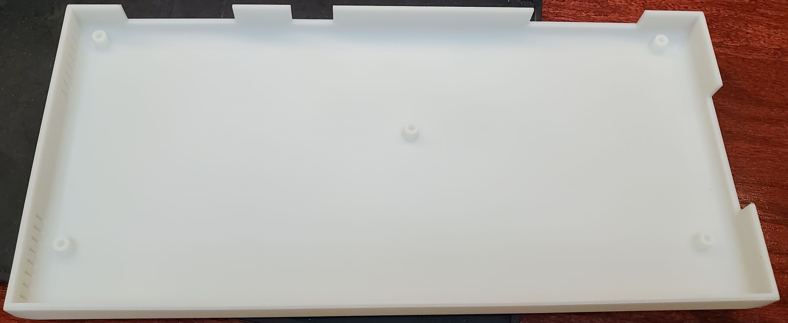
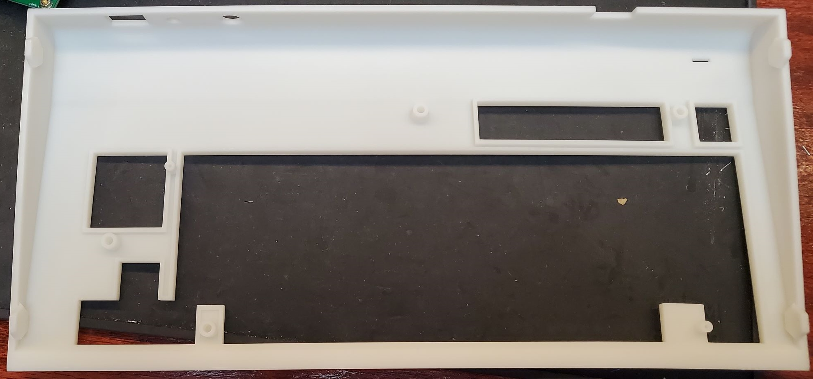
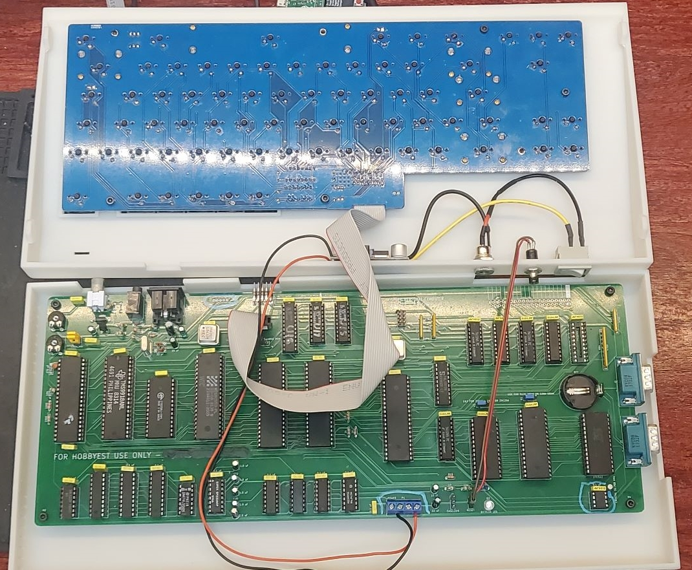
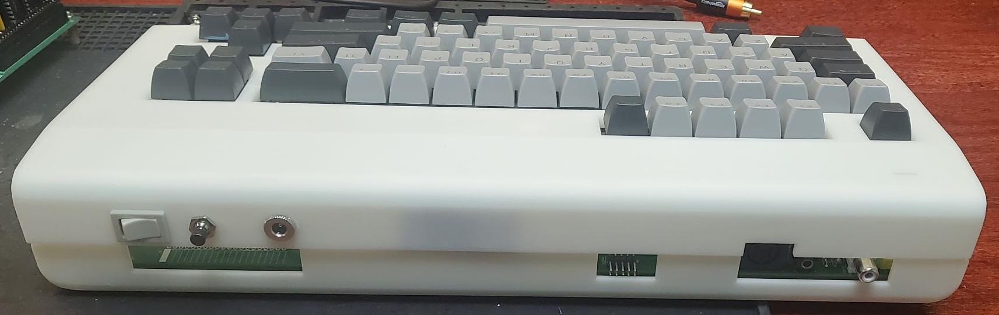

### Questions?

If there are any questions, I can be reached at vic2020Dan at gmail dot com.

---